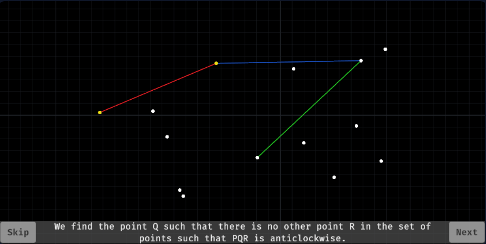

# Convex Hull Algorithms

<p align="center">

<a href="https://docs.unity3d.com/Manual/index.html" alt="Unity">
</a>

<a href="https://docs.microsoft.com/en-us/dotnet/csharp/" alt="C#">
</a>

<a href="https://docs.unity3d.com/Packages/com.unity.cinemachine@2.9/manual/index.html" alt="Cinemachine">
</a>

<a href="https://docs.unity3d.com/Packages/com.unity.textmeshpro@3.0/manual/index.html" alt="TextMeshPro">
</a>

</p>

An application for visualizing the working of two convex hull algorithms - [Jarvis March](https://en.wikipedia.org/wiki/Gift_wrapping_algorithm) and [Kirkpatrick-Seidel](https://graphics.stanford.edu/courses/cs268-16-fall/Notes/KirkSeidel.pdf) in two dimensions.

## Table of Contents

- [About the Project](#about-the-project)
- [Getting Started](#getting-started)
  - [Prerequisites](#prerequisites)
  - [Setting Up](#setting-up)
- [Usage](#usage)
    - [Controls](#controls)
    - [Screenshots](#screenshots)
- [Contributing](#contributing)
- [License](#license)
- [Credits](#credits)

## About the Project

This project aims to visually demonstrate the workings of two convex hull algorithms: Jarvis March and Kirkpatrick-Seidel, originally as a part of [Assignment-I](https://convex-hull-visualization.vercel.app/about) for CS F364: Design and Analysis of Algorithms. 

[Convex hull algorithms](https://en.wikipedia.org/wiki/Convex_hull_algorithms) are used to find the [convex hull](https://en.wikipedia.org/wiki/Convex_hull) of a set of points, which is the smallest convex set that encloses all the points and forms a convex polygon.

## Getting Started

To set up the project locally, follow the instructions below.

### Prerequisites

Before running the project, ensure you have the following  installed:

- [Unity Hub](https://unity.com/download)
- [Unity Editor](https://unity.com/releases/editor/archive) preferably v2022.3 or above with build support for platform(s) of your choice

### Setting Up

1. Clone the repository:
   ```shell
   git clone https://github.com/soppydart/Convex-Hull-Algorithms.git
   ```
2. Launch Unity Hub. 
3. Go to **Projects > Add**, locate the cloned directory using the file explorer and click on **Open**.
4. Follow [these](https://docs.unity3d.com/Manual/BuildSettings.html) steps to build the application for your preferred platform.

## Usage

### Controls

1. Click on the 2D plane to manually plot points.
2. Click on **Start** to begin. You must have at least 2 points to start.
3. Click on **Next** to proceed to the next step.
4. Click on **Skip** to skip the remaining steps and directly show the convex hull.

### Screenshots

The following screenshots were taken from [here](https://convex-hull-visualization.vercel.app/).




## Contributing

Contributions to enhance the project are welcome! If you'd like to contribute, please follow these steps:

1. Fork the project.
2. Create your feature branch. `git checkout -b feature/AmazingFeature`
3. Commit your changes. `git commit -m 'Add some AmazingFeature'`
4. Push to the branch. `git push origin feature/AmazingFeature`
5. Open a pull request.

## License

This project is licensed under the GNU General Public License v3.0. You can find the full text of the license in the [LICENSE](LICENSE) file.

## Credits

- [Hand Cursor](https://icons8.com/icon/14315/hand-cursor) icon for button hover.
- [Fira Code](https://github.com/tonsky/FiraCode) font for text. 
